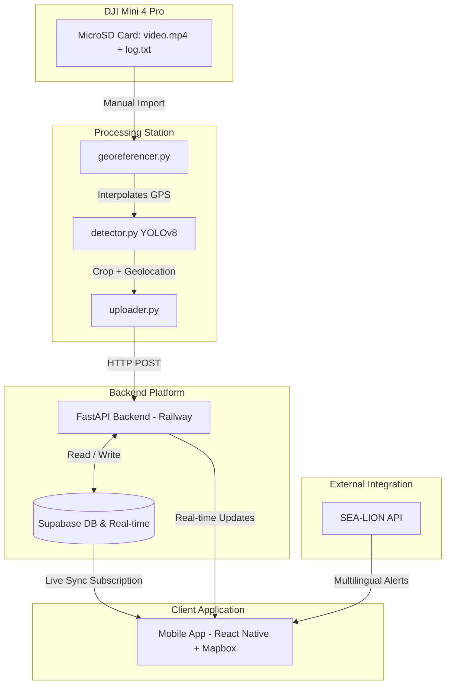

# 🌊 Beach Litter Management System

An end-to-end aerial surveillance and volunteer coordination platform. This system processes post-flight drone videos with GPS telemetry, detects litter via YOLOv8, georeferences target pins, streams updates in real-time via FastAPI and Supabase, and displays actionable cleanup zones for volunteers on a mobile app powered by Mapbox.

---

## 📌 Architecture Overview



---

## 📂 Repository Structure

```
├── backend/                  # FastAPI Backend Platform
│   ├── config.py             # Configuration / Environment vars
│   ├── main.py               # FastAPI App entrypoint
│   ├── routes.py             # REST API routes (pins, zones, alerts)
│   ├── sealion.py            # SEA-LION LLM translation service
│   └── requirements.txt      # Backend Python dependencies
│
├── processing_station/       # YOLOv8 + GPS Georeferencer
│   ├── detector.py           # YOLOv8 object detection module
│   ├── georeferencer.py      # GPS log interpolation from flight telemetry
│   ├── uploader.py           # API uploader script
│   └── requirements.txt      # Processing station Python dependencies
│
├── mobile/                   # React Native Mobile App
│   ├── App.js                # Core App component and routing
│   ├── package.json          # Mobile dependencies & scripts
│   └── screens/
│       ├── MapScreen.js      # Mapbox pins & zone visualization
│       └── AlertsScreen.js   # Multilingual notifications
│
└── supabase/                 # Supabase configuration & migrations
    └── schema.sql            # Database schema & RLS setup
```

---

## ⚙️ Setup and Installation

### 1. Database (Supabase)
- Create a new project in your [Supabase Dashboard](https://supabase.com).
- Copy the content of [supabase/schema.sql](file:///Users/prakash/Desktop/DJI-Flight-Volunteer-App/supabase/schema.sql) and run it in the Supabase SQL Editor.
- Get your Supabase URL and Service Role API Key.

### 2. FastAPI Backend
```bash
cd backend
python -m venv venv
source venv/bin/activate
pip install -r requirements.txt
# Configure your .env file with Supabase credentials
uvicorn main:app --reload
```

### 3. Processing Station
```bash
cd processing_station
python -m venv venv
source venv/bin/activate
pip install -r requirements.txt
```
To run the detection:
```bash
python detector.py --video path/to/video.mp4 --telemetry path/to/log.txt
```

### 4. Mobile App (React Native)
```bash
cd mobile
npm install
# Build & run for iOS/Android
npx react-native run-ios
# or
npx react-native run-android
```
