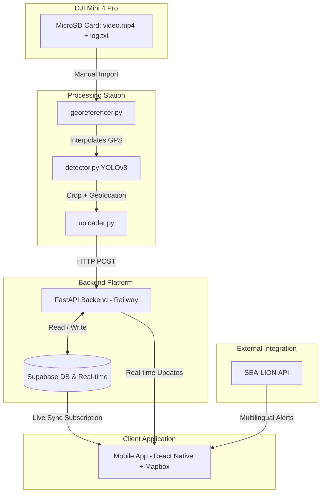

# 🌊 Beach Litter Management System

An end-to-end aerial surveillance and volunteer coordination platform. This system processes post-flight drone videos with GPS telemetry, detects litter via YOLOv8, georeferences target pins, streams updates in real-time via FastAPI and Supabase, and displays actionable cleanup zones for volunteers on a mobile app powered by Mapbox.

---

## 📌 Architecture Overview



---

## 📂 Repository Structure

```
├── backend/                  # FastAPI Backend Platform
│   ├── config.py             # Configuration / Environment vars
│   ├── main.py               # FastAPI App entrypoint
│   ├── routes.py             # REST API routes (pins, zones, alerts)
│   ├── sealion.py            # SEA-LION LLM translation service
│   └── requirements.txt      # Backend Python dependencies
│
├── processing_station/       # YOLOv8 + GPS Georeferencer
│   ├── detector.py           # YOLOv8 object detection module
│   ├── georeferencer.py      # GPS log interpolation from flight telemetry
│   ├── uploader.py           # API uploader script
│   └── requirements.txt      # Processing station Python dependencies
│
├── mobile/                   # React Native Mobile App
│   ├── App.js                # Core App component and routing
│   ├── package.json          # Mobile dependencies & scripts
│   └── screens/
│       ├── MapScreen.js      # Mapbox pins & zone visualization
│       └── AlertsScreen.js   # Multilingual notifications
│
└── supabase/                 # Supabase configuration & migrations
    └── schema.sql            # Database schema & RLS setup
```

---

## ⚙️ Setup and Installation

### 1. Database (Supabase) Setup
1. Create a new project in your [Supabase Dashboard](https://supabase.com).
2. Open the **SQL Editor** in the Supabase Dashboard, create a new query, copy the entire contents of [supabase/schema.sql](file:///Users/prakash/Desktop/DJI-Flight-Volunteer-App/supabase/schema.sql), and run it. This will create the required tables (`profiles`, `litter_pins`, `cleanup_zones`, `alerts`, `missions`), set up spatial indexes, and enable real-time publications.
3. Open the **Storage** section in the Supabase Dashboard:
   - Create a new bucket named **`litter-images`**.
   - Make sure you check **Public** (allow public access) so that images can be loaded directly from URLs in the mobile client.
4. Retrieve your **Project URL** and API keys:
   - Go to **Project Settings** -> **API**.
   - Copy the **Project URL**.
   - Copy the **`anon` (public)** key (for the mobile client).
   - Copy the **`service_role`** key (for the backend server to bypass RLS policies).

---

### 2. Environment Configuration (`.env`)

The repository contains three sub-projects, each requiring its own `.env` configuration. Ensure you copy the examples and fill in your keys correctly:

| Module | Env File Location | Source Command | Key Variables & Description |
| :--- | :--- | :--- | :--- |
| **FastAPI Backend** | `backend/.env` | `cp backend/.env.example backend/.env` | `SUPABASE_URL`: Your Supabase URL.<br>`SUPABASE_KEY`: Your Supabase **service_role** key (required to authenticate backend CRUD operations).<br>`SEA_LION_API_KEY`: SEA-LION translation model key (leave blank to use offline mock fallbacks).<br>`HOST`: `127.0.0.1` (local)<br>`PORT`: `8000` (default) |
| **Processing Station** | `processing_station/.env` | `cp processing_station/.env.example processing_station/.env` | `ROBOFLOW_PUBLISHABLE_KEY`: Roboflow model inference access key.<br>`MAPBOX_ACCESS_TOKEN`: Mapbox API token (if needed by mapping tools). |
| **Mobile Client** | `mobile/.env` | `cp mobile/.env.example mobile/.env` | `EXPO_PUBLIC_SUPABASE_URL`: Same Supabase project URL.<br>`EXPO_PUBLIC_SUPABASE_ANON_KEY`: Supabase **anon/public** key (safe to package in mobile client builds). |

> [!IMPORTANT]
> For the React Native Expo app, environment variables must start with the prefix `EXPO_PUBLIC_` so that the Metro bundler injects them into the runtime environment.

---

### 3. FastAPI Backend Setup
```bash
# Navigate to the backend directory
cd backend

# Create and activate a Python virtual environment
python -m venv venv
source venv/bin/activate  # On Windows, use: venv\Scripts\activate

# Install all backend Python dependencies
pip install -r requirements.txt

# Start the FastAPI server using the entrypoint script
python main.py
```
The backend server will run on `http://127.0.0.1:8000`. You can access the Command Center Dashboard at `http://127.0.0.1:8000/api/dashboard` or browse the interactive documentation at `http://127.0.0.1:8000/docs`.

---

### 4. Processing Station Setup (YOLO + Telemetry)
```bash
# Navigate to the processing station directory
cd processing_station

# Create and activate a Python virtual environment
python -m venv venv
source venv/bin/activate  # On Windows, use: venv\Scripts\activate

# Install processing station dependencies (includes PyTorch & OpenCV)
pip install -r requirements.txt
```

To run a georeferencing detection session:
- **Real Run** (processes OpenCV video stream and runs YOLOv8 models):
  ```bash
  python detector.py --video path/to/video.mp4 --telemetry path/to/telemetry_log.csv --backend http://localhost:8000 --model solar_panel.pt
  ```
- **Mock Run** (simulates flight and coordinates, sending test pins to backend without needing OpenCV/YOLO installed):
  ```bash
  python detector.py --video mock.mp4 --telemetry mock_telemetry.csv --backend http://localhost:8000 --mock
  ```

---

### 5. Mobile App Setup (React Native + Expo)
```bash
# Navigate to the mobile directory
cd mobile

# Install Node modules and native dependencies
npm install

# Start the Expo Metro Bundler
npm start
```
For physical mobile testing:
1. Download the **Expo Go** application from the iOS App Store or Android Play Store.
2. Start the bundler with an ngrok/expo tunnel:
   ```bash
   npm start -- --tunnel
   ```
3. Scan the QR code displayed in your terminal using the Expo Go application or your camera app.

---

## 🧪 Verification and Testing

You can verify that the system setups, configurations, and API endpoints are working properly by running the automated unit and integration tests from the root of the repository:

### Test Supabase Connection & CRUD Schemas
Make sure you have completed the backend `.env` configuration. Then run:
```bash
python test_supabase.py
```

### Test General Integration Pipelines
To test the georeferencing interpolation, SEA-LION fallback translations, and FastAPI process tasks, run:
```bash
python test_system.py
```
